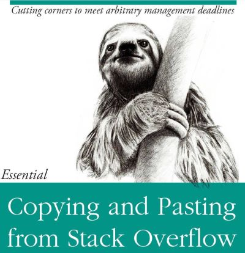

# (PART) Week 1 {-} 

<!-- This file by Martin Monkman is licensed under a Creative Commons Attribution 4.0 International License https://creativecommons.org/licenses/by/4.0/   -->

# Why Code? Why R? {#why_code}

## Objectives {#why_code-objectives}

> The important thing is that you solve the problem that you’re working on, not write the most concise and elegant code (although that’s definitely something you want to strive towards!)
> - Grolemund & Wickham, _R for Data Science_

At the end of this lesson, learners will be able to:

1. Describe the fundamental elements of data manipulation, and 

2. Demonstrate how these can be applied using R.

### Readings {#why_code-readings}

* [_R for Data Science_, Workflow: basics](https://r4ds.had.co.nz/workflow-basics.html)

* [_R for Data Science_, Data Transformation](https://r4ds.had.co.nz/transform.html)

## Using a programming language to do data analysis  {#why_code-pgm}

Analysis of data helps us make better decisions. And computers have accelerated how much data we can analyze.

Here's a structured way to approach any analysis:

> 1. Generate questions about your data.
>
> 2. Search for answers by visualising, transforming, and modelling your data.
>
> 3. Use what you learn to refine your questions and/or generate new questions.^[@Wickham_Grolemund2016, [7. Exploratory Data Analysis](https://r4ds.had.co.nz/exploratory-data-analysis.html)]

Data science is where **data analytics** (applying math & statistics to a subject area) is done in a **coding** environment...

In this course, we will use the term "data science" to describe the use of a computer programming language to do data analysis. In this use, a data scientist is someone who applies subject matter expertise, foundational statistical knowledge, and some pragmatic programming skills to a data analysis problem. [@Monkman_bird_2019]

The _process_ of data science has been defined like this [@Wickham_Grolemund2016]:

We will be referring to this model frequently...get used to seeing it!

We can do data analysis using GUI (Graphical User Interface) tools, such as Excel or Tableau. But using a programming language to write code that generates your analysis will make you more efficient and effective, open up a universe of additional functionality, and make your analysis workflow 

* reproducible and auditable, 

* accurate, and 

* collaborative. [@Parker_2017]  

The emphasis in this course will be on analytic methods, coding concepts, and programming practice that are universal; you will be able to apply them in whatever analytic setting you find yourself, and are independent of the tool you'll be using. 

By the end of this course, you will see the relationship between the raw data that you will import and the table, plot, or model you want to create, and use a variety of functions to achieve that transformation. 

In his presentation "Reproducible Data Science with R" [@Smith_reproducible_2017], David Smith says that no matter what tool or language you are using, a reproducible process

> * Saves time,
> * Produces better science,
> * Creates more trusted research,
> * Reduces the risk of errors, and
> * Encourages collaboration.

So what is a "reproducible workflow"?

Here's an insight into how the work on a data analysis project looks in real life. In this case, the author of the tweet has specified a "scientific project", but it applies to any type of data analysis, whether in the context of business intelligence, economics, history, ecology, or astrophysics:

<blockquote class="twitter-tweet">
Every scientific project will be redone in its entirety about 10-20 times from start to publication. Plan your work flow accordingly, e.g. a piece of R code that takes a data file and produces the analysis and figure/s. Change the data? Just rerun the code.
&mdash; Trevor A. Branch (\@TrevorABranch) <a href="https://twitter.com/TrevorABranch/status/1157006269292507136?ref_src=twsrc%5Etfw">August 1, 2019</a></blockquote>  

In many work places, someone (it might be a data analyst or financial analyst) is often producing monthly and quarterly reports. The reports look more or less like the previous edition—the data is updated, and the job is to create new summary tables and charts, and sometimes add new text elements. If you are using a GUI (Graphical User Interface) program like Microsoft Excel, every time the data is updated, the steps are the same: a lot of point-and-click copy-and-paste drag-and-drop work to download the data, update the tables, calculate the new summary tables, change the charts, and then hit "print". A human has to do all of those steps; but if we can write some code, it will streamline our workflow.

Here's an example:

[NHPI]

### Why R?  {#why_code-why-r}

In this course we will be primarily using the open source programming language R, with tangents into data analysis coding in Python.

Here's another course description, one that I really like, so (with the author's permission) I am including it here:

> Over the last decade there has been a revolution in statistical and scientific computing. Open source languages like R and Python have overtaken older (and expensive!) corporate software packages like SAS and SPSS, and there are now thousands of books and blog posts and other online resources with excellent tutorials about how to analyze pretty much any kind of data.
>This class will expose you to R—one of the most popular, sought-after, and in-demand statistical programming languages. Armed with the foundation of R skills you’ll learn in this class, you’ll know enough to be able to find how to analyze any sort of data-based question in the future.
<small>(from the Syllabus to [PMAP 8521: Program Evaluation for Public Service](https://evalf19.classes.andrewheiss.com/syllabus/#pep-talk), Andrew Heiss, Georgia State University)</small>

It goes without saying that data science is an expansive subject area. A key tool supporting data science work is the statistical programming language R, which has grown signficantly over the past few years and has, in the words of Roger Peng, "become the de facto programming language for data science. Its flexibility, power, sophistication, and expressiveness have made it an invaluable tool for data scientists around the world." [@Peng2018]

Proprietary tools (including statistical programs like SAS, SPSS, and Stata) have had a one-version-at-a-time approach to development and release. With each release, many new features are added, extending the functionality. These releases are scheduled big events; as one example, SAS has been releasing version updates roughly once a year since 2010.

The open source nature of R and its package-centric ecosystem has encouraged the expansion of functionality, and like the expansion of the universe as a whole, the expansion of the R universe is in all directions simultaneously and non-stop. There isn't just one annual updates with the latest bells and whistles—it sometimes seems that every day brings news that additional features are being applied to existing R packages, and new packages are being released.

This "bazaar"[@Raymond_CatB] of development makes it impossible to be an expert on all things R, and that paper-based text books may be out-of-date before they get to the presses. More importantly, it also means that somebody somewhere may have already found a creative solution to the data analysis problem you've just encountered.

This is where the R community really shines. The spirit of the bazaar extends to open data, open science, open research, and open development. Your friends in the R community around the world are making their tools and techniques available, and are using social media channels to tell one another about it, which spurs on collaboration and futher innovations, in a never-ending virtuous cycle.

](static/img/code_hero_rstats_600.png)

Another part of the R community is the proliferation of hexagonal laptop stickers, which fit neatly together and give a visual signal to other members of the R community.

For one of my projects, the workflow used to look something like this:

Every time the data switches from one tool to another, there is a risk of unexpected transformations in the values.

In GUI tools, there's also a risk of point-and-click errors which cannot be traced back.

It now looks like this:

Your code (and additional recordkeeping with your code) helps explain your work to others.

> In every project you have at least one other collaborator: future-you. You don’t want future-you to curse past-you.
—Hadley Wickham (source: [Roel M. Hogervorst](https://www.r-bloggers.com/2016/05/your-most-valuable-collaborator-future-you/)

> Your closest collaborator is you six months ago, but you don't reply to emails.
— Karl Broman

But you will also want or need to collaborate with other people. With more remote working, we have the ability to create working relationships with people around the world. A point-and-click approach to data analysis does not facilitate this...but the code you write will be a key element in having a successful collaboration.

***

## R: An analogy  {#why_code-r-analogy}

### Base R {#why_code-r-analogy-base}

R is a data science / statistics programming language. Because it developed as a data analysis and statistical tool, unlike many other open-source programming languages, it has built-in analytic and statistical functions, and the data structures are designed for data analysis.

In this analogy, base R is like the engine and frame of a car & basic controls like the pedals and steering wheel.

We can get from Point A to Point B, but it isn't going to be a very comfortable ride.

### Packages  {#why_code-r-analogy-packages}

Packages extend the functionality of R. Each package does a rather limited number of things, so we sometimes find ourselves using many packages for a data analysis project.

R packages might focus on:

* data wrangling & cleaning

* data analysis and statistical modeling

* data visualization

* data (that is, they contain datasets, and make it easy to access the data)

In the car analogy, the packages are the other things that enhance the car's functions

* the body, windshield, headlights, A/C, sound system, etc

The ride will be much more comfortable, and we might even be able to go places that base R can't venture.

In this course, we will be relying heavily (but not exclusively) on a group of packages known as "the tidyverse". 

"The tidyverse is an opinionated collection of R packages designed for data science. All packages share an underlying design philosophy, grammar, and data structures."

The [{tidyverse} site](https://tidyverse.org): tidyverse.org

### RStudio  {#why_code-r-analogy-rstudio}

RStudio is an IDE (interactive development environment).

* we will be using the cloud (internet) version of the IDE

Note:

* "RStudio" is also the company that developed and supports the IDE

* and RStudio the company is active creating and supporting packages, including many of the tidyverse packages

In our car analogy, RStudio is the dashboard and controls

That's rather old-fashioned and rudimentary. In reality, RStudio is very modern, customizable, and has an _enormous_ number of features. So it's more like this:

And because it's customizable, you can opt for different colour schemes, including dark mode!

Who's ready for a road trip?!

### Languages  {#why_code-languages}

...are difficult. We use different words to mean the same thing. The grammar of different language varies. Languages also use different characters.

Your mind is flexible...

> Yuor brian is so pfweroul, taht it can raed scntenees wtih mxied up wrods as lnog as teh fsrit and lsat letetrs are in the rgiht palce.

...but computers are literal. Accuracy matters.

And spelling also matters.

...and in R, so does upper and lower case. There are all different:

* "word"

* "Word"

* "WORD".

### What data scientists do  {#why_code-work}

> Data scientists spend 60% of their time on cleaning and organizing data. Collecting data sets comes second at 19% of their time, meaning data scientists spend around 80% of their time on preparing and managing data for analysis.

- Forbes: ["Cleaning Big Data: Most Time-Consuming, Least Enjoyable Data Science Task, Survey Says"](https://www.forbes.com/sites/gilpress/2016/03/23/data-preparation-most-time-consuming-least-enjoyable-data-science-task-survey-says/#22d5a9446f63)

**Getting help**

* RStudio: built-in help: `?<function_name>`

* Cheatsheets: https://rstudio.com/resources/cheatsheets/

* Package vignettes

**And for future reference...**

* RStudio Community: https://community.rstudio.com/ 

* Stack Overflow: https://stackoverflow.com/

* Blogs

**The truth about how programmers really work**

First of all: the internet is a powerful tool.

Using someone else's code, and changing it to work in your circumstance, is normal.

Or consider this image, from what is now a Mexican restaurant in the Los Angeles area. It had been a Chinese restaurant, and rather than paint over the entire mural of pandas, the new owners painted sombreros on the pandas.

We might say that reading about how to do something, and copying the code and changing the variable names to suit our needs, is _painting sombreros on the pandas_.

## Exercise: Introduction to R  {#why_code-exercise}

In this exercise, you'll tackle the basics of the R language.

[Introduction to R](https://monkmanmh.shinyapps.io/BIDA302_1-1_intro/?_ga=2.143188981.1105120215.1603418925-1358848496.1603418925#section-objectives)

***

## Digging deeper into these topics 

**Opinionated analysis development & reproducible analysis**

Hilary Parker, 2017-08-31, [Opinionated analysis development](https://peerj.com/preprints/3210/), PeerJ Preprints 5:e3210v1 https://doi.org/10.7287/peerj.preprints.3210v1

[The reproducible workflow](https://remi-daigle.github.io/2017-CHONe-Data/cleaning.nb.html) -- from Data Management Workshop à la CHONe

Munafò, M., Nosek, B., Bishop, D. et al. [A manifesto for reproducible science](https://www.nature.com/articles/s41562-016-0021). Nat Hum Behav 1, 0021 (2017) doi:10.1038/s41562-016-0021

**Why R?**

Nathaniel D. Phillips, [YaRrr! The Pirate’s Guide to R](https://bookdown.org/ndphillips/YaRrr/) 

- [Chapter 1.3, "Why is R so great?"](https://bookdown.org/ndphillips/YaRrr/why-is-r-so-great.html)

- [Chapter 2, "Getting Started"](https://bookdown.org/ndphillips/YaRrr/started.html) provides a good summary of R, RStudio, and packages

"History and Overview of R", Chapter 2 in Roger Peng, 2019-12-22, [_R Programming for Data Science_](https://bookdown.org/rdpeng/rprogdatascience/history-and-overview-of-r.html)

Lucy D'Agostino McGowan, 2017-07-28, [R release names](https://livefreeordichotomize.com/2017/09/28/r-release-names/)

- [an up-to-date list](https://bookdown.org/martin_monkman/DataScienceResources_book/using-r.html#r-release-names)

## Installing R on your own computer  {#why_code-r-install}

For BIDA302, we will be using [rstudio.cloud](https://rstudio.com/products/cloud/) and there is no need for you to install R and RStudio on your own computer.

However, if you wish to do so, you are welcome to take that step. And of course, once BIDA302 is complete, my hope is that you see yourself using this powerful too, and want to continue your journey.

Here are some resources for you to take the step of installing the software on your own computer:

J.D. Long and Paul Teetor, _R Cookbook (2nd edition)_

* ["Getting Started and Getting Help"](https://rc2e.com/gettingstarted)

* See recipes 1.1 through 1.3

Garrett Grolemund, _Hands-On Programming with R_

* [Appendix A: "Installing R and RStudio"](https://rstudio-education.github.io/hopr/starting.html)

* [Appendix B: "R Packages"](https://rstudio-education.github.io/hopr/packages2.html)

Danielle Navarro, [_running R on your own computer_](https://youtube.com/playlist?list=PLRPB0ZzEYegOZivdelOuEn-R-XUN-DOjd)

* A series of videos on youtube, with installation instructions for different operating systems (Mac, Windows, and Ubuntu linux), as well as loading and installing packages from both CRAN and GitHub (where many in-development packages are available)

***

