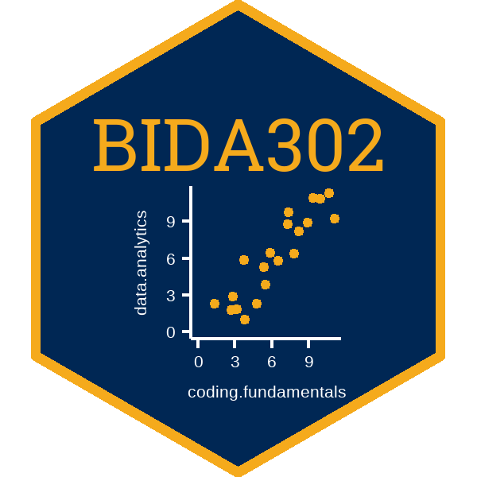

BIDA302 
==========================================================

## UVic Data Analytics Coding Fundamentals (BIDA302) course materials

[Data Analytics Coding Fundamentals](https://continuingstudies.uvic.ca/business-technology-and-public-relations/courses/data-analytics-coding-fundamentals)

[Series: Business Intelligence and Data Analytics](https://continuingstudies.uvic.ca/business-technology-and-public-relations/series/business-intelligence-and-data-analytics)

> The important thing is that you solve the problem that you’re working on, not write the most concise and elegant code (although that’s definitely something you want to strive towards!)
> - Grolemund & Wickham, _R for Data Science_, 2.15 (The map functions)

## Course outline:

[BIDA302, Spring 2020](https://github.com/MonkmanMH/UVic_BIDA302/blob/master/course_outline/00_course-outline.md) -- draft, subject to change

## Solutions to hands-on exercises

Solutions to the in-class hands-on exercises can be found as online interactive tutorials; they are housed in the [tutormanner](https://github.com/MonkmanMH/tutormanner) 

## Versions:

2020.2.x -- offered 2020, spring (2020-02-29 to 2020-04-04) 

2019.1.x -- offered 2019, fall (2019-11-02 to 2019-12-07)

