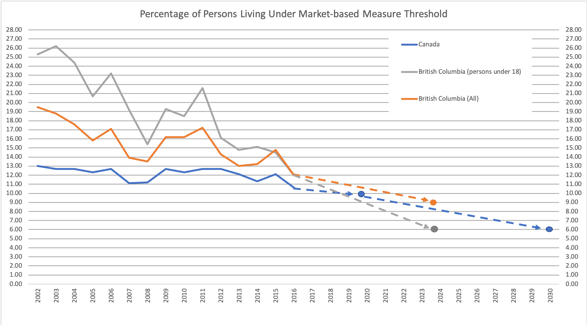

## Low income statistics

### 

[Finally, a poverty plan. But will it work?](https://www.macleans.ca/economy/economicanalysis/the-most-important-charts-to-watch-in-2019/)

**Data source**

[Low income statistics by age, sex and economic family type](https://www150.statcan.gc.ca/t1/tbl1/en/tv.action?pid=1110013501)

Frequency: Annual

Table: 11-10-0135-01 (formerly CANSIM 206-0041)

Geography: Canada, Geographical region of Canada, Province or territory, Census metropolitan area

Related:

1. Census 2016: [Individual MBM Low-income Status (6) and Economic Family Characteristics of Persons (25) for the Population in Private Households of Canada, Provinces and Territories, Census Metropolitan Areas and Census Agglomerations, 2016 Census - 25% Sample Data](https://www12.statcan.gc.ca/census-recensement/2016/dp-pd/dt-td/Rp-eng.cfm?LANG=E&APATH=3&DETAIL=0&DIM=0&FL=A&FREE=0&GC=0&GID=0&GK=0&GRP=1&PID=110727&PRID=10&PTYPE=109445&S=0&SHOWALL=0&SUB=999&Temporal=2016,2017&THEME=119&VID=0&VNAMEE=&VNAMEF=)

2. [Market Basket Measure (MBM) thresholds for the reference family by Market Basket Measure region, component and base year](https://www150.statcan.gc.ca/t1/tbl1/en/tv.action?pid=1110006601)

Frequency: Annual

Table: 11-10-0066-01

Geography: Census metropolitan area, Census agglomeration, Census metropolitan area part

[Statistics Canada Open License Agreement](http://www.statcan.gc.ca/eng/reference/licence)

#### references

Kourtney Kobel and Tammy Schirle, ["The differential impact of universal child benefits on the labor supply of married and single mothers"](http://www.lcerpa.org/public/papers/LCERPA_2015_11.pdf)

Tyler Cowen, 2016, ["Why is female labor force participation down?"](http://marginalrevolution.com/marginalrevolution/2016/11/female-labor-force-participation.html) - U.S. measures

