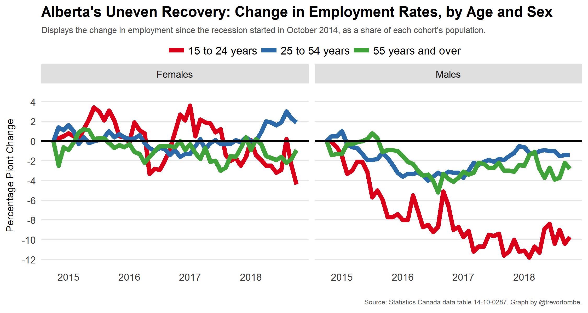

## Labour force participation by age

### Background

[Alberta's uneven recovery](https://www.macleans.ca/economy/economicanalysis/the-most-important-charts-to-watch-in-2019/)

### Data source

data file: "data_14100287_trunc.csv"

**NOTE:** 

the data available for this project is a truncated of the source file listed below. A number of variables have been removed, and any non-estimate values have been filtered out. See the file data_truncate.Rmd for details.

[Labour force characteristics, monthly, seasonally adjusted and trend-cycle, last 5 months](https://www150.statcan.gc.ca/t1/tbl1/en/tv.action?pid=1410028701)

Frequency: Monthly

Table: 14-10-0287-01 (formerly CANSIM 282-0087)

Geography: Canada, Province or territory

[Statistics Canada Open License Agreement](http://www.statcan.gc.ca/eng/reference/licence)

#### references

Kourtney Kobel and Tammy Schirle, ["The differential impact of universal child benefits on the labor supply of married and single mothers"](http://www.lcerpa.org/public/papers/LCERPA_2015_11.pdf)

Tyler Cowen, 2016, ["Why is female labor force participation down?"](http://marginalrevolution.com/marginalrevolution/2016/11/female-labor-force-participation.html) - U.S. measures

