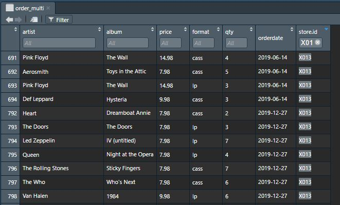
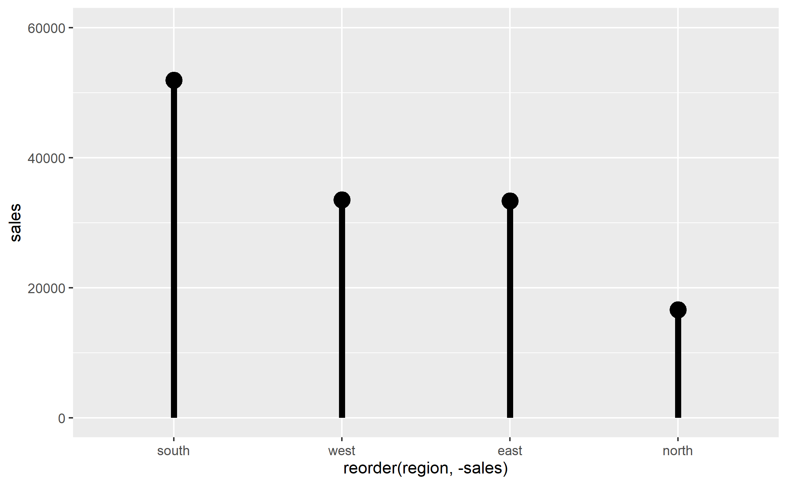

## The scenario: 

The fictional wholesale company, CR25 (for "Classic Rock 25") only sells 25 album titles. They are the biggest selling / most famous albums by the 25 most-played artists on "Classic Rock" radio stations in the U.S.A.^[Walt Hickey, [Why Classic Rock Isn’t What It Used To Be](https://fivethirtyeight.com/features/why-classic-rock-isnt-what-it-used-to-be/) (FiveThirtyEight, 2014-07-07).]

Your company, being completely nostalgic, hasn't added those new-fangled CDs yet ... all you sell is LPs and, for the hip kids to play in their Sony Walkmans and boomboxes, cassettes.

The database team at the warehouse has just run an extract for you, with the detailed orders from every store you deal with. A snapshot looks like this:

You work in the marketing department, and need to make a summary for the company's annual meeting. You will need to present tables and charts showing performance by chain and region. 

You might want something like this:

Other things to explore would be sales by chain, by month or quarter, or by artist. 

