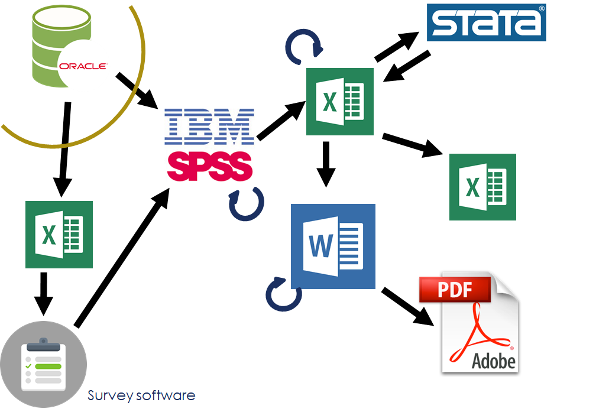
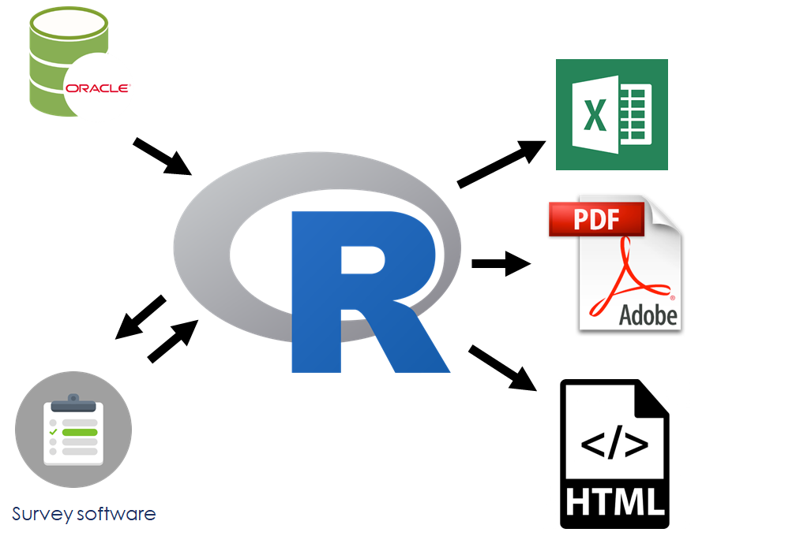
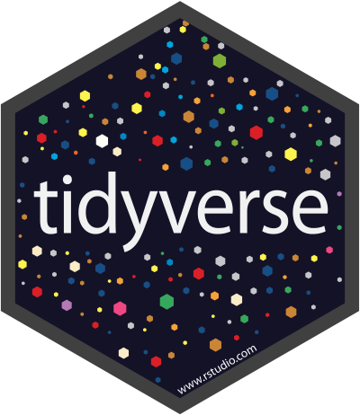

```{r setup, include=FALSE}
options(htmltools.dir.version = FALSE)
```

class: inverse


# Why code?


## Reproducible workflow

>Saves time,

>Produces better science,

>Creates more trusted research,

>Reduces the risk of errors, and

>Encourages collaboration.

- David Smith, [Reproducible Data Science with R](https://blog.revolutionanalytics.com/2017/04/reproducible-data-science-with-r.html)

???

David Smith, 2017-04-21, [Reproducible Data Science with R](https://blog.revolutionanalytics.com/2017/04/reproducible-data-science-with-r.html)

Hilary Parker, [“Opinionated Analysis Development”](https://peerj.com/preprints/3210/), 2017-08-31

* Reproducible and Auditable

* Accurate

* Collaborative


---

class: inverse

# What is R?

Base R: a script-based statistical analysis tool

* with many, many packages (data, statistical functions, wrappers of other software)

RStudio, an IDE that streamlines much of your work

* including authoring tools for communication


---
class: inverse

# Workflow and functionality: 1



---
class: inverse

# Workflow and functionality: 2



---

class: inverse

# Community

Twitter: #rstats

R-bloggers.com

Meetup groups 

- RLadies


---
class: inverse


# Learning a new language

--

Also: might have to adapt your mental map of how data analytics "looks"

---

class: inverse


## Your mind is flexible

### Yuor brian is so pfweroul, taht it can raed scntenees wtih mxied up wrods as lnog as teh fsrit and lsat letetrs are in the rgiht palce.

.fafaff[Yuor brian is so pfweroul, taht it can raed scntenees wtih mxied up wrods as lnog as teh fsrit and lsat letetrs are in the rgiht palce.]

---
class: inverse


# Computers are literal

Accuracy matters


---
class: inverse


# Computers are literal

Spelling matters


...and in R, so does case

---
class: inverse


# RStudio

IDE (interactive development environment)

* also the company that developed and supports the IDE

* they do a lot of other great stuff, too


---
class: inverse

# Welcome to The Tidyverse



???

Image source: https://github.com/rstudio/hex-stickers (for all tidyverse hex images)

---

class: inverse

# {tidyverse}

"The tidyverse is an opinionated collection of R packages designed for data science. All packages share an underlying design philosophy, grammar, and data structures."

The [{tidyverse} site](https://tidyverse.org)

