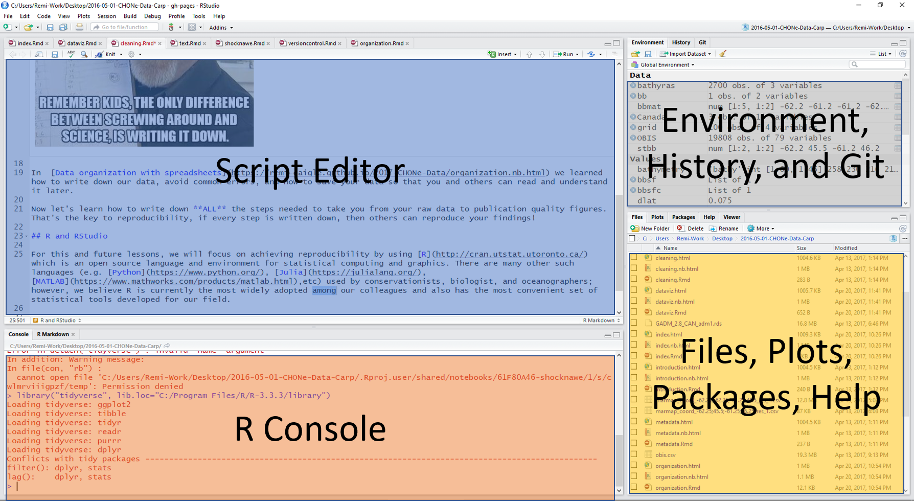

```{r setup, include=FALSE}
options(htmltools.dir.version = FALSE)

library(tidyverse)
```

class: inverse

# R


Data science / statistics programming language


---
class: inverse


# RStudio

Integrated development environment (IDE)

* also the company that makes and supports the IDE

* they do a lot of other great things, as well


---

class: inverse

# RStudio cloud




---
class: inverse

# Console

## R as calculator

Type in the console window:

`10 + 4`

---
class: inverse

# The power of named variables |  Creating a named object 

## the assignment arrow

`<-`

First: create a new R script file


## assign the object "x" with the value 10

`x <- 10` 

--

> To show `x` in the console, just type `x`


---
class: inverse

> How would you create a new object "y" with the value 4?

--
`y <- 4`


> Now add x and y

--


`x + y`

--

> Did you notice the change in the Environment pane?


---
class: inverse

# How would you set `x` equal to 20?

--

`x <- 20`

--

# And now divide `x` by `y`

`x / y`

---
class: inverse

`t <- "If it's inside quotation marks, it's a character"`


Now print the object `t`

---
class: inverse

## Vector -- a series of values

`x <- 1:10`

`x <- seq(1, 10)`

---
class: inverse

# `c` for concatenate

x <- c(1, 5, 6)

y <- c("British Columbia", "Alberta")


---
class: inverse

# Functions

`function_name(arg1 = val1, arg2 = val2, ...)`

`mean(x)`


---
class: inverse

# Packages

R uses “packages” to extend the functionality

* statistical and data analysis

* data visualization

* data

---
class: inverse

# Welcome to The Tidyverse


???

Image source: https://github.com/rstudio/hex-stickers (for all tidyverse hex images)

---

class: inverse

# {tidyverse} -

"The tidyverse is an opinionated collection of R packages designed for data science. All packages share an underlying design philosophy, grammar, and data structures."

The [{tidyverse} site](https://tidyverse.org)

***

Two tidyerse packages we will be using today:

{dplyr} - data wrangling
{tidyr} - to pivot (spread and gather) data tables
{mpg} - contains a dataframe.


---
class: inverse


# Quick Detour: getting help

Typing a question mark (?) and a package or function brings up the Help info (bottom right pane)

Type the following:

`?mpg`

Or, once a package is loaded, it is accessible through the Help pane (bottom right) and will auto-fill once you start typing, which often shows many other things!

---
class: inverse

## Quick Detour: Sources of help

* `?package` or `?function`

* package page and vignettes

* cheat sheets

* Stack Overflow

* blogs 


---
class: inverse

# Quick Detour: some helpful base R functions

```{r}
View(mpg)       ## opens data to view, too big to show here

names(mpg)      ## lists the names of all variables in dataset

summary(mpg)    ## provides statistical summary of data

```


---
class: inverse


# R Markdown

R Markdown allows you to 

* save and execute code 

* generate high quality reports

* use as a working notebook

--

Many formats of output:

* HTML (for web browsers)

* Word, PDF

* Slides (including PowerPoint)

* reports and academic articles, books, blogs and websites

---
class: inverse

# Markdown

Go to your web browser and open [dillinger.io](https://dillinger.io/)


---
class: inverse

# R Markdown

Combines text (in Markdown) with R code

* the cheat sheet!

Work within RStudio...


