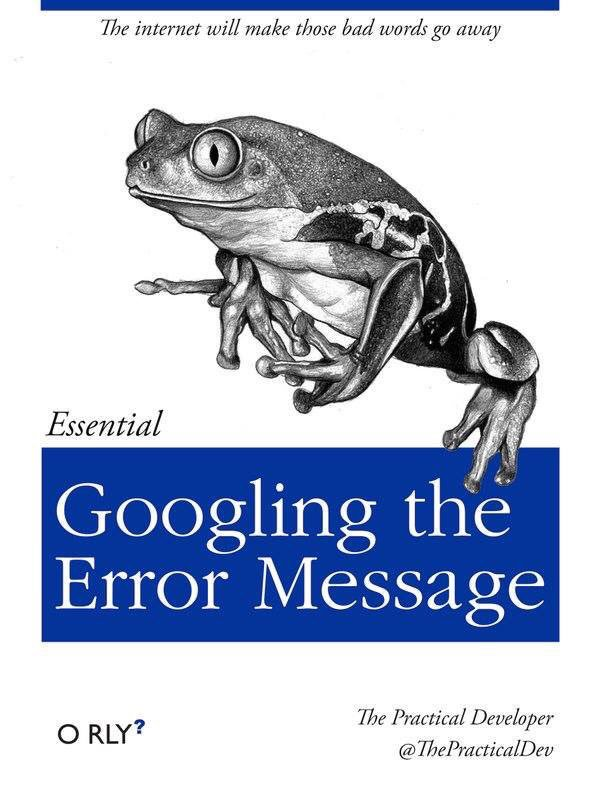
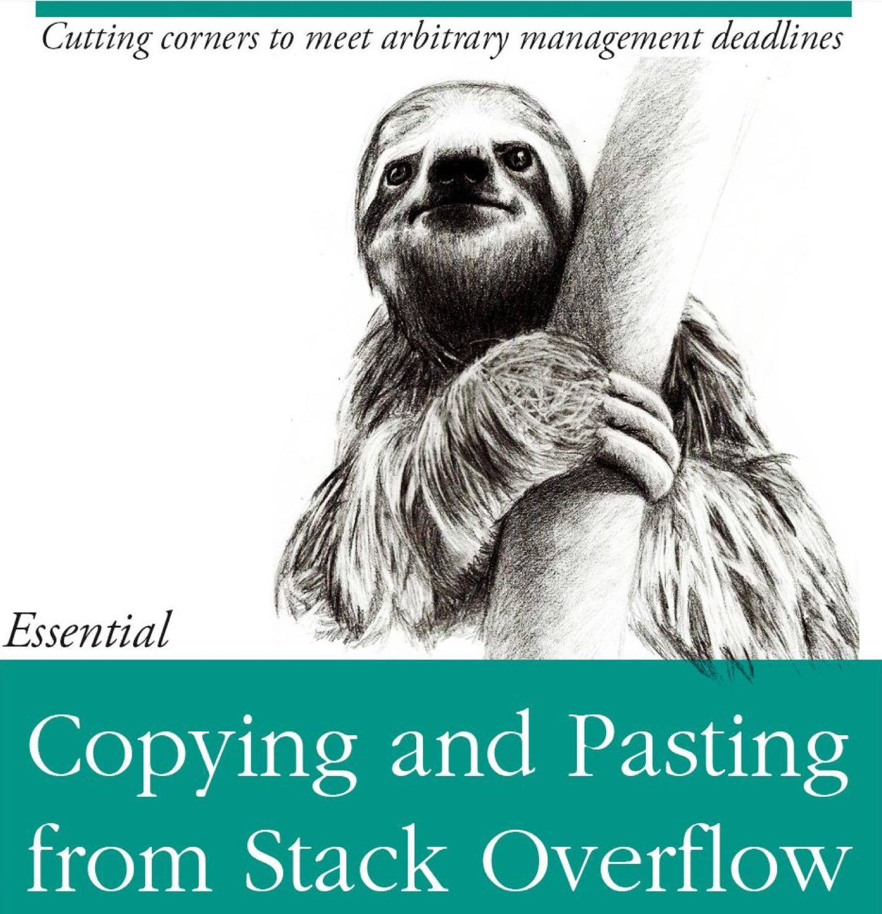

```{r setup, include=FALSE}
options(htmltools.dir.version = FALSE)
```

class: inverse

# What data scientists do


> Data scientists spend 60% of their time on cleaning and organizing data. Collecting data sets comes second at 19% of their time, meaning data scientists spend around 80% of their time on preparing and managing data for analysis.

- Forbes: "Cleaning Big Data: Most Time-Consuming, Least Enjoyable Data Science Task, Survey Says"

???

Forbes: ["Cleaning Big Data: Most Time-Consuming, Least Enjoyable Data Science Task, Survey Says"](https://www.forbes.com/sites/gilpress/2016/03/23/data-preparation-most-time-consuming-least-enjoyable-data-science-task-survey-says/#22d5a9446f63)

---

The process


Also: what we'll be covering in this course 


---

# The truth about how programmers work

O'Rly?



---

# The truth about how programmers work, part 2

O'Rly?



---

# Sombreros on the pandas


