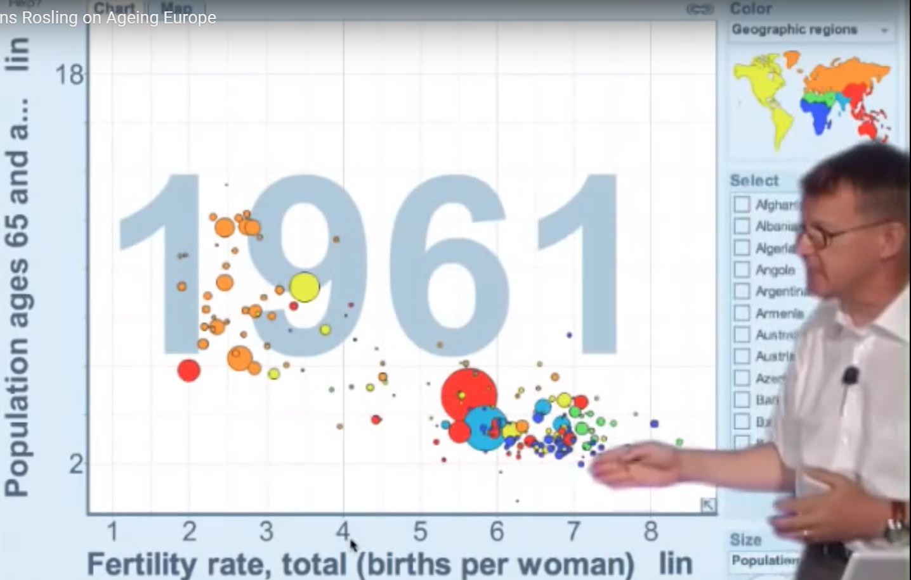

## YOUR NAME HERE


Package load:
```{r setup}

library(tidyverse)
library(readxl)

```


## Introduction

> For this homework assignment, please write your answer for each question after the question text but before the line break before the next one.

> In some cases, you will have to insert R code chunks, and run them to ensure that you've got the right result.

> Use all of the R Markdown formatting you want! Bullets, bold text, etc. is welcome.

> Once you have finished your assignment, create an HTML document by "knitting" the document using either the "Preview" or "Knit" button in the top left of the script window frame


## Questions

In this assignment, you will recreate an approximation of the chart Hans Rosling shows in the video here:

* Presentation Zen, [Hans Rosling: the zen master of presenting data](https://www.presentationzen.com/presentationzen/2010/07/hans-rosling-tips-on-presenting-data.html), 2010-07-11

This image captures the 1961 version of the plot:



### Data files

I downloaded four files from https://www.gapminder.org/data/ that you will need

There are CSV files for the following:

* Population, total: "population_total.csv"

* Population, aged 60+: "population_aged_60plus_years_total_number.csv"

* Babies per woman (total fertility): "children_per_woman_total_fertility.csv"

In addition, I downloaded an Excel file that you'll need to use to get the region that each country is in. 

* "Data Geographies - v1 - by Gapminder.xlsx", sheet = "list-of-countries-etc"


### Load and select

```{r}

pop_total <- read_csv("population_total.csv")

pop_60plus <- read_csv("population_aged_60plus_years_total_number.csv")

children_per_woman <- read_csv("children_per_woman_total_fertility.csv")


```


```{r}

pop_total

```


```{r}

pop_total %>%
  select(country, "1960", "2015")

pop_total_6015 <- pop_total %>%
  select(country, "1960", "2015") %>%
  pivot_longer(-country, names_to = "year", values_to = "population")

pop_total_6015

```


```{r}

pop_60plus %>%
  select(country, "1960", "2015")

pop_60plus_6015 <- pop_60plus %>%
  select(country, "1960", "2015") %>%
  pivot_longer(-country, names_to = "year", values_to = "pop_60plus")

pop_60plus_6015


```

```{r}

children_per_woman %>%
  select(country, "1960", "2015")

children_per_woman_6015 <- children_per_woman %>%
  select(country, "1960", "2015") %>%
  pivot_longer(-country, names_to = "year", values_to = "fert_rate")

children_per_woman_6015

```


Read country geography table

```{r}

data_geographies <- read_excel("Data Geographies - v1 - by Gapminder.xlsx", sheet = "list-of-countries-etc")

data_geographies_select <- data_geographies %>%
  select(geo, name, four_regions)

data_geographies_select

```


### join the four tables

```{r}

df_gapmind <-
pop_total_6015 %>%
  inner_join(pop_60plus_6015, by = c("country", "year")) %>% 
  inner_join(children_per_woman_6015, by = c("country", "year")) %>% 
  mutate(pct_60plus = round((pop_60plus / population * 100), 2))
  
df_gapmind <-
df_gapmind %>% 
  inner_join(data_geographies_select, by = c("country" = "name"))

df_gapmind
```


## Plot

```{r}

df_gapmind %>%
  filter(year == 1960) %>%
# plot
ggplot() +
  geom_point(mapping = aes(x = fert_rate, y = pct_60plus))


```


```{r}

plotyear <- 1960

df_gapmind %>%
  filter(year == plotyear) %>%
# plot
ggplot() +
  geom_point(mapping = aes(x = fert_rate, y = pct_60plus, color = four_regions))
  
```


```{r}

# add balloon plotting for population size

plotyear <- 1960

df_gapmind %>%
  filter(year == plotyear) %>%
# plot
ggplot() +
  geom_point(mapping = aes(x = fert_rate, y = pct_60plus, color = four_regions, size = population)) +
  scale_size_area(max_size = 15)
  
```


# Fertility by Life Expectancy

```{r}

plotyear <- c(1960, 2015)

df_gapmind %>%
  filter(year %in% plotyear) %>%
# plot
ggplot() +
  geom_point(mapping = aes(x = fert_rate, y = pct_60plus, color = four_regions, size = population)) +
  scale_size_area(max_size = 15) +
  facet_grid(. ~ year)


```


```{r}

plotyear <- c(1960, 2015)

df_gapmind %>%
  filter(year %in% plotyear) %>%
# plot
ggplot() +
  geom_point(mapping = aes(x = fert_rate, y = pct_60plus, size = population)) +
  scale_size_area(max_size = 15) +
  facet_grid(year ~ four_regions)

df_gapmind %>%
  filter(year %in% plotyear) %>%
# plot - flip the facets
ggplot() +
  geom_point(mapping = aes(x = fert_rate, y = pct_60plus, size = population)) +
  scale_size_area(max_size = 15) +
  facet_grid(four_regions ~ year)


```

## references

https://towardsdatascience.com/how-to-build-animated-charts-like-hans-rosling-doing-it-all-in-r-570efc6ba382

https://remi-daigle.github.io/2016-04-15-UCSB/viz/

https://rafalab.github.io/dsbook/gapminder.html


https://datacarpentry.org/dc_zurich/R-ecology/05-visualisation-ggplot2.html

https://tutorials.iq.harvard.edu/R/Rgraphics/Rgraphics.html


