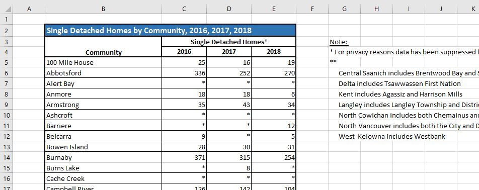

```{r setup}

library(tidyverse)
#
library(readxl)

```

# Reading Excel files

> This exercise relies on the package {readxl}. 
> 
> * [documentation for {readxl}](https://readxl.tidyverse.org/)
> 
>   - in particular, review the "Overview" page and the "Articles"
>   


## 1. New Homes Registry

> The B.C. Ministry of Municipal Affairs and Housing publishes data from BC Housing's New Homes Registry, by regional district and municipality, by three types types of housing: single detached, multi-unit homes, and purpose built rental.
>
> The name of this file is "bc-stats_2018-new-homes-data_tosend.xlsx"


### 1a. Explore the file

> List the sheet names in the file. 

```{r}

excel_sheets("bc-stats_2018-new-homes-data_tosend.xlsx")

```


### 1b. Importing a sheet
 
> Here's a screenshot of the top rows of the sheet with single detached housing:
> 
> 
> 
> What problems do you anticipate with the way this sheet is laid out? 
> 
> * For a data analytics project, will you need all of the rows and columns that have information?
> 
> * Check the data types of each column.
> 
> Read in the sheet, using no options. What is notable about the content of the R data table, compared to the Excel source?


```{r}

read_excel("bc-stats_2018-new-homes-data_tosend.xlsx", sheet = "Purpose Built Rental")

```

> Read the file again, so that the header rows are in the right place, and with the "Note:" column omitted.
> 
> (See [this page on the {readxl} reference material](https://readxl.tidyverse.org/reference/cell-specification.html) for some tips.)
> 
> Note: some solutions to this problem would involve some of the {dplyr} data manipulations, once you've created an object that you can manipulate in the R environment.


Some solutions:

```{r}

housing1 <- read_excel("bc-stats_2018-new-homes-data_tosend.xlsx", sheet = "Single Detached", 
                       na = "*",
                       skip = 3)

# Because this has columns F and G included, we can then use "select" to pick the ones we want

housing1 <- housing1 %>% 
  select(1:4) %>% 
  rename("community" = `...1` )

housing1

```


```{r}

housing2 <- read_excel("bc-stats_2018-new-homes-data_tosend.xlsx", sheet = "Single Detached", 
                       na = "*",
                       range = cell_limits(c(4, NA), c(NA, 5)))

housing2 %>% 
  select(2:5) %>%
  rename("community" = `...2`)

```


```{r}

housing3 <- 
  read_excel("bc-stats_2018-new-homes-data_tosend.xlsx", sheet = "Single Detached",
             na = "*",
             range = anchored("B4", dim = c(NA, 4)))

housing3 %>%
  rename("community" = "...1")

```


### 1c. Tidy data

> Does this data frame violate any of the principles of tidy data?
> 
> If so, use the pivot functions from {tidyr} to turn it into a tidy structure.

```{r}

housing1

housing1_long <- housing1 %>%
  pivot_longer(-community, names_to = "year", values_to = "units")

housing1_long

```

### 1d. EDA: plotting, 1

> Now you've got a tidy structure, it's time for some exploratory data analysis!
> 
> Plot the total number of single detached homes built in B.C. by year.
> 
> **Hints and resources:**
> 
> * The [Data visualisation](https://r4ds.had.co.nz/data-visualisation.html) and [Exploratory data analysis](https://r4ds.had.co.nz/exploratory-data-analysis.html) chapters of _R for Data Science_ might be handy references
> 
> * The [{ggplot2} reference pages](https://ggplot2.tidyverse.org/)
> 
> * You might need to do further data manipulation before you can plot what you want
> 
> * Sometimes I find it _very_ helpful to make a sketch of the plot I envision, and then writing down which variables are associated with the bits on the plot

```{r}
housing1_long %>%
  group_by(year) %>%
  summarise(units = sum(units, na.rm = TRUE)) %>% 
ggplot(aes(x = year, y = units)) +
         geom_point()
```


### 1e. EDA: plotting, 2

> Plot the total number of single detached homes built in B.C. by municipality, but only the top 10 municipalities, sorted from most to least.
> 
> **Hints and resources:**
> 
> * The [Factors](https://r4ds.had.co.nz/factors.html) chapter of _R for Data Science_ 
> 
> * The [{forcats} reference pages](https://forcats.tidyverse.org/)
> 
> * Again, you might need to do further data manipulation before you can plot what you want


```{r}

housing1_long %>%
  group_by(community) %>%
  summarise(units = sum(units, na.rm = TRUE)) %>%
  arrange(desc(units)) %>%
  mutate(unit_rank = rank(desc(units))) %>%
  filter(unit_rank <= 10) %>% 
  
ggplot(aes(x = community, y = units)) +
         geom_point()


```


---


# Data sources

* The Excel file is already in the rstudio.cloud project

### New Homes Registry

Data source: BC Data Catalogue

* [New Homes Registry (2016-2018)](https://catalogue.data.gov.bc.ca/dataset/new-homes-registry-2016-2018-)


