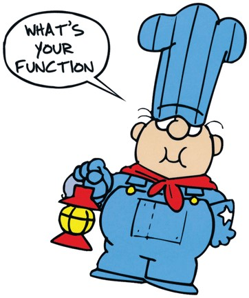

<!-- 
This file by Martin Monkman is licensed under a Creative Commons Attribution 4.0 International License (https://creativecommons.org/licenses/by/4.0/). 

The content is drawn largely from _R for Data Science_ by Hadley Wickham and Garrett Grolemund
-- (https://r4ds.had.co.nz/) -- which in turn is licensed under the Creative Commons
Attribution-NonCommercial-NoDerivs 3.0 (CC BY-NC-ND 3.0 US) 
-->

```{r setup}
library(tidyverse)

library(gapminder)
```


## Objectives

* Understand and describe when and why a function is of value

* Understand the components of a function





Functions are an important part of programming in R. You have already used many functions ... now it's time to write your own.

Functions have particular value in making your code DRY (don't repeat yourself). If you need to do the same thing over and over again (whether in this script, or next month / quarter), you can either copy-and-paste with a few changes, or take the time to write a generalized function. 

With a function, there's fewer opportunities for error (say you miss a replacement)


### REFERENCE

["Functions" in _R for Data Science_](https://r4ds.had.co.nz/functions.html) by Hadley Wickham and Garrett Grolemund


["Functions", from _Introduction to the R Language_](https://www.stat.berkeley.edu/~statcur/Workshop2/Presentations/functions.pdf), Berkley, Biostatistics 140.776


["Creating Functions", from _Programming with R_](https://swcarpentry.github.io/r-novice-inflammation/02-func-R/), Software Carpentry


