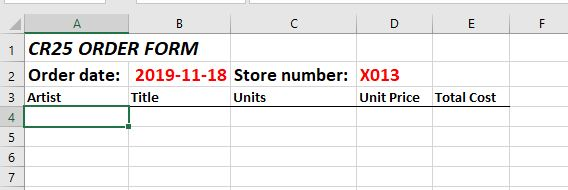
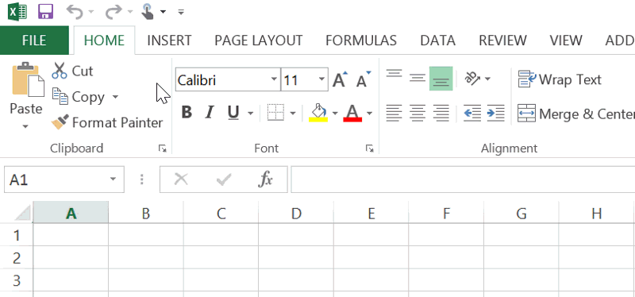
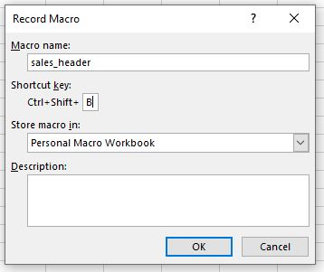
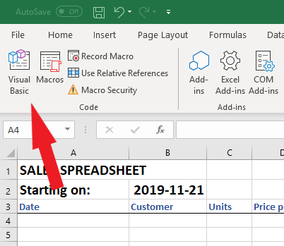

```{r setup, include=FALSE}
options(htmltools.dir.version = FALSE)


```

# The Data Science Process ... 


- Wickham and Grolemund, _R4DS_

## ... doesn't care (much) about your tools

---

class: inverse

# Visual Basic for Applications (VBA)

* repetitive tasks

* generalizable 


---

class: inverse

## A simple macro

Imagine that first thing on Monday morning every week, we have a new spreadsheet that collects some simple sales information. 
At the top of that spreadsheet, we've got some simple text to tell us what the sheet is all about:





---

class: inverse

# Step 0:

### make sure "Developer" menu is in toolbar



---

class: inverse


# Step 1:

### start recording

* Open the Developer tab in the ribbon
* Click on "Record Macro"


---

class: inverse


* In the "Record Macro" dialog box
  - "Macro name:" -- enter "sales_header"
  - "Shortcut key:" -- enter <shift> B
* In the "Store Macro in" drop down, select "Personal Macro Workbook"




* Click **OK**.

???

The Personal Macro Workbook: saves general-purpose macros that are available to any workbook

---

class: inverse


# Step 2:

### start entering the text

* In the start date cell (B2) enter the formula `=TODAY()`
* In the "Total cost" column, in E4 enter the formula to multiply the number of units by the unit price
* Change the formatting


---

class: inverse


# Step 3:

### stop recording

* Click the "Stop Recording" button in the Developer toolbar


---

class: inverse


# Step 4:

### test our macro

* Open a new, blank Excel file

* press "<CTRL> <SHIFT> B"


---

class: inverse


# Step 5:

### edit the VBA code

* Click on the Developer menu

* Click on "Visual Basic"




---


---


# MACRO #2

### generate a pivot table


---

## References

[Quick start: Create a macro](https://support.office.com/en-us/article/quick-start-create-a-macro-741130ca-080d-49f5-9471-1e5fb3d581a8)

[Work with macros {video}](https://support.office.com/en-us/article/video-work-with-macros-654cc76b-1c9c-4632-89e1-67230322e92f) -- first of series

[Create a macro](https://www.excel-easy.com/vba/create-a-macro.html)

[Create an Excel Macro to Speed Up Your Repetitive Tasks!](https://www.microassist.com/software-tips/create-an-excel-macro/)

[Introduction to Writing Excel Macros](https://www.excelfunctions.net/writing-excel-macros.html)

[5 Uses for VBA Macros in Excel with Your Job](https://www.excelcampus.com/vba/5-uses-for-macros/)

[Will VBA Die in 2019?](https://www.thespreadsheetguru.com/blog/are-vba-macros-dead)


---

```{r eval=FALSE}

library(gapminder)
library(dplyr)

gapminder_data <- gapminder

gapminder_data1957 <- gapminder_data %>% 
  filter(year == 1957)

readr::write_csv(gapminder_data1957, "gapminder_data1957.csv")

gapminder_data2007 <- gapminder_data %>%
  filter(year == 2007)
readr::write_csv(gapminder_data2007, "gapminder_data2007.csv")


```

