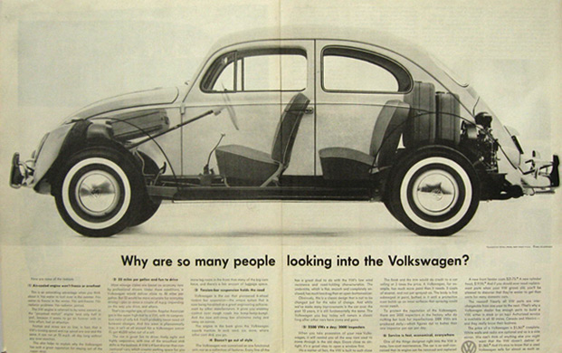
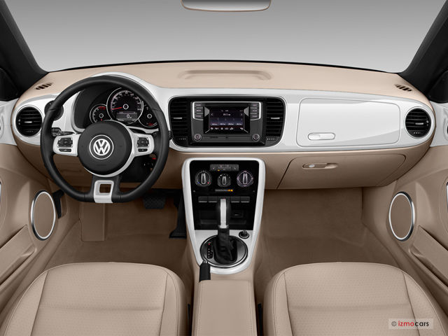

```{r setup, include=FALSE}
options(htmltools.dir.version = FALSE)

library(tidyverse)
library(lubridate)
```

# The Data Science Process


- Wickham and Grolemund, _R4DS_

We have spent 5.5 weeks talking about this process with **R** ... but it's not the only tool set available.


---


[python.org](https://www.python.org/)


---

Base R is like the engine and frame of a car & basic controls like the pedals and steering wheel


---

...the packages are the other things that enhance the car's functions

* the body, windshield, headlights, A/C, sound system, etc




---

...and RStudio is the dashboard and controls


---

(more like this)



---

dark mode!


---

Python is like an engine.

It can power a car...or a boat, or a water pump, or ...


---

Python is a general-purpose programming language. 

* Which means that it _doesn't_ have data analysis functions built in.

* When you load base R, you get the engine and the frame, steering wheel, and pedals.

* To do data analysis in Python, you need to load the _modules_ that are the frame, steering wheel, etc.


---


# Run in rstudio.cloud

{reticulate} -- R Interface to Python

* [reference pages](https://rstudio.github.io/reticulate/)


---

## Python code chunk in R Markdown


` ```{python}   ` <br>
`  some python code  ` <br>
` ```  `


---

## Python data analysis modules

* [NumPy](https://numpy.org/) -- "the fundamental package for scientific computing with Python"

* [pandas](https://pandas.pydata.org/) -- "providing...data structures and data analysis tools"

* [SciPy](https://www.scipy.org/)

* [Matplotlib](https://matplotlib.org/) -- data visualization


---

## Some Python resources


[_Python for Data Analysis_, 2nd edition](https://www.oreilly.com/library/view/python-for-data/9781491957653/), Wes McKinney (2017)

["A Quick Introduction to the “Pandas” Python Library"](https://towardsdatascience.com/a-quick-introduction-to-the-pandas-python-library-f1b678f34673) -- Adi Bronshtein, 2017-04-17

["Pandas basics"](https://www.learnpython.org/en/Pandas_Basics)

[Beginner's Tutorial on the Pandas Python Library](https://stackabuse.com/beginners-tutorial-on-the-pandas-python-library/)

[pandas: Python data analysis library](https://teachdatascience.com/pandas/)

[reticulate: running Python within RStudio](https://teachdatascience.com/reticulate/)

---

## Cheat sheets

[{reticulate}](https://github.com/rstudio/cheatsheets/raw/master/reticulate.pdf) -- calling Python from R

[data wrangling with pandas](https://pandas.pydata.org/Pandas_Cheat_Sheet.pdf)

