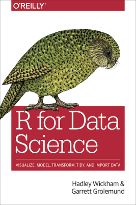

```{r setup, include=FALSE}
knitr::opts_chunk$set(echo = FALSE)
```

## Data Analysis Coding Fundamentals

### Martin Monkman

* email:  mmonkman@uvic.ca

* "office hours" via skype

  - Tuesday, 8:00 pm to 9:00 pm
  
  -  <a href="callto:<monkmanmh>">monkmanmh</a>

### The course website

* martinmonkman.com/courses/bida302_2019

* syllabus, materials, lesson plans


## Stucture

### Class

Saturday, 9:00 am - 4:00 pm

* hour for lunch

* a bit of lecture

* lots of hands-on

### Assignments

* time in class to get started

 

## Learning outcomes

- Perform basic data manipulations
- Create variables
- Apply key concepts of variables, constants and functions
- Calculate descriptive statistics
- Perform basic logical formula functions
- Group and ungroup data
- Data importing & exporting
- Extract and combine data
- Create _what-if_ scenarios


## Meta outcome 1: using **R**

Programming environment designed for statistical analysis / data science 

* Focus on one tool, so you get good at that


## Meta outcome 2: principles 

Concepts and practices that you can carry through to other environments

* will have examples of coding in Excel and Python


## RStudio Connect

Web-based version of R & RStudio

_add web address for course content_

* later today, we'll run through the steps to install R on your own computer


## Text book:

Hadley Wickham & Garrett Grolemund, _R for Data Science_

* website: [r4ds.had.co.nz](https://r4ds.had.co.nz/)



## Supplementary resources and readings

For each section:

- specific material

- optional: supplementary deeper-dives

_Look for this on the course website_


## Getting help

* Cheatsheets

* Stack Overflow

* Vignettes and blogs


## Collaboration & community

IRL we work together

"To teach is to learn twice"

The R user community:

* welcoming & non-judgemental

* twitter #rstats

* in-person: conferences & user groups

* RLadies

* hex stickers!


## Code of Conduct

- from the R Consortium

~ Be a decent human being


## Icebreaker ...


## About me

* UVic Geography 

* BC Stats 

  - 1993 to present (with 5 year gap)

* using R for 8 years


