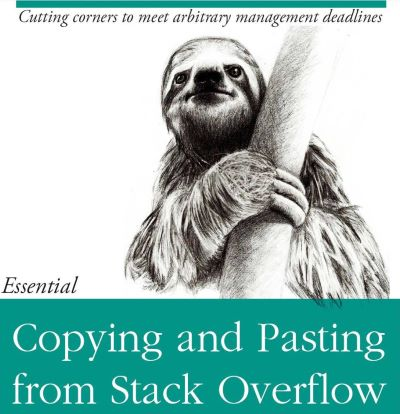

<!-- 
This file by Martin Monkman 
is licensed under a Creative Commons Attribution 4.0 International License
https://creativecommons.org/licenses/by/4.0/  
-->


```{r setup, include=FALSE}
options(htmltools.dir.version = FALSE)
```

```{r xaringan-themer, include=FALSE, warning=FALSE}
library(xaringanthemer)
style_duo_accent(
  primary_color = "#16161D",
  secondary_color = "#6e6e91",
  inverse_header_color = "#e2e2e9",
  header_font_google = google_font("Raleway"),
  text_font_google   = google_font("Raleway"),
  code_font_google   = google_font("Fira Mono")
)
```


# Learning outcomes

* Perform basic data manipulations
* Create variables
* Apply key concepts of variables, constants and functions
* Calculate descriptive statistics
* Perform basic logical formula functions
* Group and ungroup data
* Data importing & exporting
* Extract and combine data
* Create _what-if_ scenarios


---


## Meta outcome 1: using R

Programming environment designed for statistical analysis / data science 

* Focus on one tool, so you get good at that


---


## Meta outcome 2: principles 

Concepts and practices that you can carry through to data analysis in other environments

* will have examples of coding in Excel and Python


---

class: inverse


# Course Stucture

---

## Class

Saturday, 9:00 am - 12:00 noon

Sunday, 9:00 am - 12:00 noon

* a bit of lecture

* lots of hands-on

## Assignments

* time in class to get started

---


# The course moodle

link: [continuingstudies.uvic.ca/](https://continuingstudies.uvic.ca/), then login with NetLink 

* course outline

* lesson plans and slide decks

* links to other reading material and data files

* forum
 

---


# RStudio Cloud

Web-based version of R & RStudio

[Link](https://rstudio.cloud/spaces/34702/join?access_code=lr5keQ5WXcZ5ENNAZoLEAmPSQHav8seVNT2j36e%2F) (but will be invitation-only after today's class)

* later today, we'll run through the steps to install R on your own computer


---


# Text book

.pull-left[

Hadley Wickham & Garrett Grolemund, _R for Data Science_

* website: [r4ds.had.co.nz](https://r4ds.had.co.nz/)
]


.pull-right[


]

---

## Supplementary resources and readings

For each topic:

- specific material

- optional: supplementary deeper-dives

_Look for this on the course moodle_


---

## Getting help

* Cheatsheets: https://rstudio.com/resources/cheatsheets/

* Stack Overflow: https://stackoverflow.com/

* Package vignettes

* Blogs


---
class: inverse


## Icebreaker ...


---

## Collaboration & community

IRL we work together

"To teach is to learn twice"

The R user community:

* welcoming & non-judgemental

* twitter #rstats

* in-person: conferences & user groups

* RLadies

* hex stickers!


---


## Code of Conduct

_from the R Consortium_

* be open

* be considerate

* be respectful

In other words:

~ Be a decent human being


---

# Martin Monkman

email:  <a href="mailto:<mmonkman@uvic.ca>">mmonkman@uvic.ca</a>

"office hours" via zoom

* Tuesday, 8:00 pm to 9:00 pm


---

## About me


* UVic Geography B.Sc. & M.A.

* BC Stats: 1993 to present (with 5 year gap)

* writing code since 1979

  - to do data analysis since 1993
  
  - using R since 2012

]


---
class: inverse

# Why code?


---

## Reproducible workflow

>Saves time,

>Produces better science,

>Creates more trusted research,

>Reduces the risk of errors, and

>Encourages collaboration.

>- David Smith, [Reproducible Data Science with R](https://blog.revolutionanalytics.com/2017/04/reproducible-data-science-with-r.html)

???

David Smith, 2017-04-21, [Reproducible Data Science with R](https://blog.revolutionanalytics.com/2017/04/reproducible-data-science-with-r.html)

Hilary Parker, [“Opinionated Analysis Development”](https://peerj.com/preprints/3210/), 2017-08-31

* Reproducible and Auditable

* Accurate

* Collaborative


---

# Workflow and functionality: 1


---

# Workflow and functionality: 2


---


# A collaborative community

Twitter: #rstats

R-bloggers.com

Meetup groups 

RLadies

???

Reading:

Julia Stewart Lowndes, 2019-12-10, [Open Software Means Kinder Science](https://blogs.scientificamerican.com/observations/open-software-means-kinder-science/), _Scientific American_ blog


---


# 1. Base R

* a data science / statistics programming language

* built-in analytic functions


---

# 2. packages

Packages extend the functionality of R

* statistical and data analysis

* data visualization

* data


---


---


# 3. RStudio

IDE (interactive development environment)

* also the company that developed and supports the IDE

* RStudio is also active creating and supporting packages, including...


---

## The Tidyverse


???

Image source: https://github.com/rstudio/hex-stickers (for all tidyverse hex images)

---


## {tidyverse}

"The tidyverse is an opinionated collection of R packages designed for data science. All packages share an underlying design philosophy, grammar, and data structures."

The [{tidyverse} site](https://tidyverse.org): tidyverse.org


---

# An analogy...

Base R is like the engine and frame of a car


---

..the packages are the other things that enhance the car's functions


---

...and RStudio is the dashboard and controls


---

(more like this)


---

## Who's ready for a road trip?!


---


class: inverse


## Road trip starts now!


---

# Learning a new language


...is difficult

???
image source: https://www.huffpost.com/entry/multilingual-prowess-6-ti_b_11108636

---


## Your mind is flexible...

.fafaff[
Yuor brian is so pfweroul, taht it can raed scntenees wtih mxied up wrods as lnog as teh fsrit and lsat letetrs are in the rgiht palce.
]

---

# ...but computers are literal

Accuracy matters


---

And spelling matters


...and in R, so does case


---

# Naming objects in R

Object names: 

* must start with a letter

* can only contain letters, numbers, `_`, and `.`

* _no spaces!_

Be descriptive!

---


## Three principles for (file) names

machine readable

human readable

plays well with default ordering

* from Jenny Bryan, ["How to name files"](https://speakerdeck.com/jennybc/how-to-name-files)

---

### Naming files

Some other suggestions: 

* only use letters, numbers, `_`, and `.`

* _no spaces!_

---

# Dates

## ISO 8601

YYYY-MM-DD

Note: see XKCD, ["ISO 8601"](https://xkcd.com/1179/)


---

class: inverse

# RStudio cloud

Visit: https://rstudio.cloud/spaces/TBD

If you haven't already, log in or sign up

"Save a copy" of the project


---


## RStudio


---

## Console

## R as calculator

Type in the console window:

`10 + 4`

--

What happened?


---

First create a new R script file


---

# The power of named variables 

## the assignment arrow

`<-`

> "less than" plus hyphen


---

## assign the object "x" with the value 10

`x <- 10` 

--

> To show `x` in the console, just type `x`


---

> How would you create a new object "y" with the value 4?

--


`y <- 4`


> Now add x and y

--


`x + y`

--

> Did you notice the change in the Environment pane?


---

# How would you set `x` equal to 20?

--

`x <- 20`

--

# And now divide `x` by `y`

`x / y`

---

`t <- "If it's inside quotation marks, it's a character"`


Now print the object `t`


---

# Quick Detour
## functions for objects

|function |action |
| :--- | ---: |
| `ls()`    | *list objects*|
| `str()`    | *display structure of object*|
| `ls.str()`    | *list objects and their structure*|
| `names()`    | *display structure of object*|


---

## Vector -- a series of values

`x <- 1:10`

`x <- seq(1, 10)`

---

# `c` to make a list

`c` is for "concatenate"

x <- c(1, 5, 6)

y <- c("British Columbia", "Alberta")

---

# The difference between vectors and lists

A vector can contain only one type of variable (all numbers, or all characters)

* 1, 2, 3

* "BC", "AB", "SK"

A list can contain any type of variable

* 1, "BC", NA


---

# Functions

general structure:

`function_name(arg1 = val1, arg2 = val2, ...)`

--

a simple example:

`mean(x)`


---


---

### R Markdown

.pull-left[
...allows you to 

* save and execute code 

* generate high quality reports

* use as a working notebook
]

--

.pull-right[
...and output:

* HTML (for web browsers)

* Word, PDF

* slides (including PowerPoint)

]

Used for reports and academic articles, books, blogs and websites

---


---

# Markdown

A simplified formatting markup language with plain text syntax

_Go to your web browser and open [dillinger.io](https://dillinger.io/)_


---

# R Markdown

Combines text (in Markdown) with R code

* the cheat sheets!

Work within RStudio...


---

# Welcome to The Tidyverse


???

Image source: https://github.com/rstudio/hex-stickers (for all tidyverse hex images)

---


# {tidyverse} -

"The tidyverse is an opinionated collection of R packages designed for data science. All packages share an underlying design philosophy, grammar, and data structures."

The [{tidyverse} site](https://tidyverse.org): tidyverse.org

---
class: inverse

Two tidyerse data transformation packages we will be using today:

{dplyr} - data wrangling

{tidyr} - to pivot (spread and gather) data tables


---

## Loading a package

There are two steps to getting a package ready to use:

1. download and install

`install.packages()`

**Our RStudio environment has all the packages you'll need!**

2. load

`library()`


---


# Quick Detour
##getting help

In the console, typing a question mark (?) and a package or function brings up the Help info (bottom right pane)

Type the following:

`?mpg`

Or, once a package is loaded, it is accessible through the Help pane (bottom right) and will auto-fill once you start typing


---

# Quick Detour
## other sources of help

* `?package` or `?function`

* package page and vignettes

* cheat sheets

* Stack Overflow

* blogs 


---

class: inverse

# The Data Science Process

---


## What data scientists do


> Data scientists spend 60% of their time on cleaning and organizing data. Collecting data sets comes second at 19% of their time, meaning data scientists spend around 80% of their time on preparing and managing data for analysis.

- Forbes: "Cleaning Big Data: Most Time-Consuming, Least Enjoyable Data Science Task, Survey Says"

???

Forbes: ["Cleaning Big Data: Most Time-Consuming, Least Enjoyable Data Science Task, Survey Says"](https://www.forbes.com/sites/gilpress/2016/03/23/data-preparation-most-time-consuming-least-enjoyable-data-science-task-survey-says/#22d5a9446f63)

---

## The data science process


Also: what we'll be covering in this course 


---

### The truth about how programmers really work


---

### The truth about how programmers work, part 2




---

### Sombreros on the pandas


