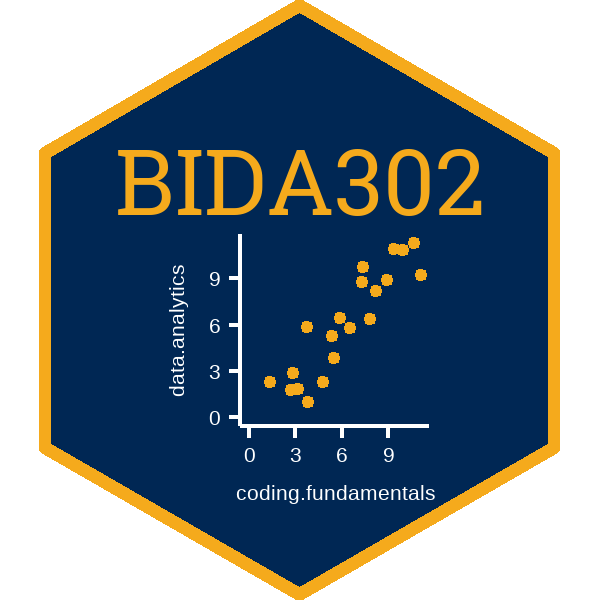

<!-- 
This file by Martin Monkman 
is licensed under a Creative Commons Attribution 4.0 International License
https://creativecommons.org/licenses/by/4.0/  
-->


```{r setup, include=FALSE}
options(htmltools.dir.version = FALSE)

library(tidyverse)
```

```{r xaringan-themer, include=FALSE, warning=FALSE}
library(xaringanthemer)
style_duo_accent(
  primary_color = "#16161D",
  secondary_color = "#6e6e91",
  inverse_header_color = "#e2e2e9",
  header_font_google = google_font("Raleway"),
  text_font_google   = google_font("Raleway"),
  code_font_google   = google_font("Fira Mono")
)
```





---

## The data science process


---

## Text book

.pull-left[

Hadley Wickham & Garrett Grolemund, _R for Data Science_

* website: [r4ds.had.co.nz](https://r4ds.had.co.nz/)
]


.pull-right[


]


---
class: inverse


---

## Data wrangling


---
.pull-left[

### with {dplyr}

- `filter()`

- `select()`

- `mutate()`

]

.pull-right[

### with {tidyr}

- `pivot_wider()`

- `pivot_longer()`

]

---

## Importing


---

## with {readr} 

`read_csv()`


## {readxl} 

`read_excel()`

---

## documenting your work


---

## Next: data visualization


---

## Perhaps how the road trip feels right now...


---


## ...but it _will_ be like this! 


